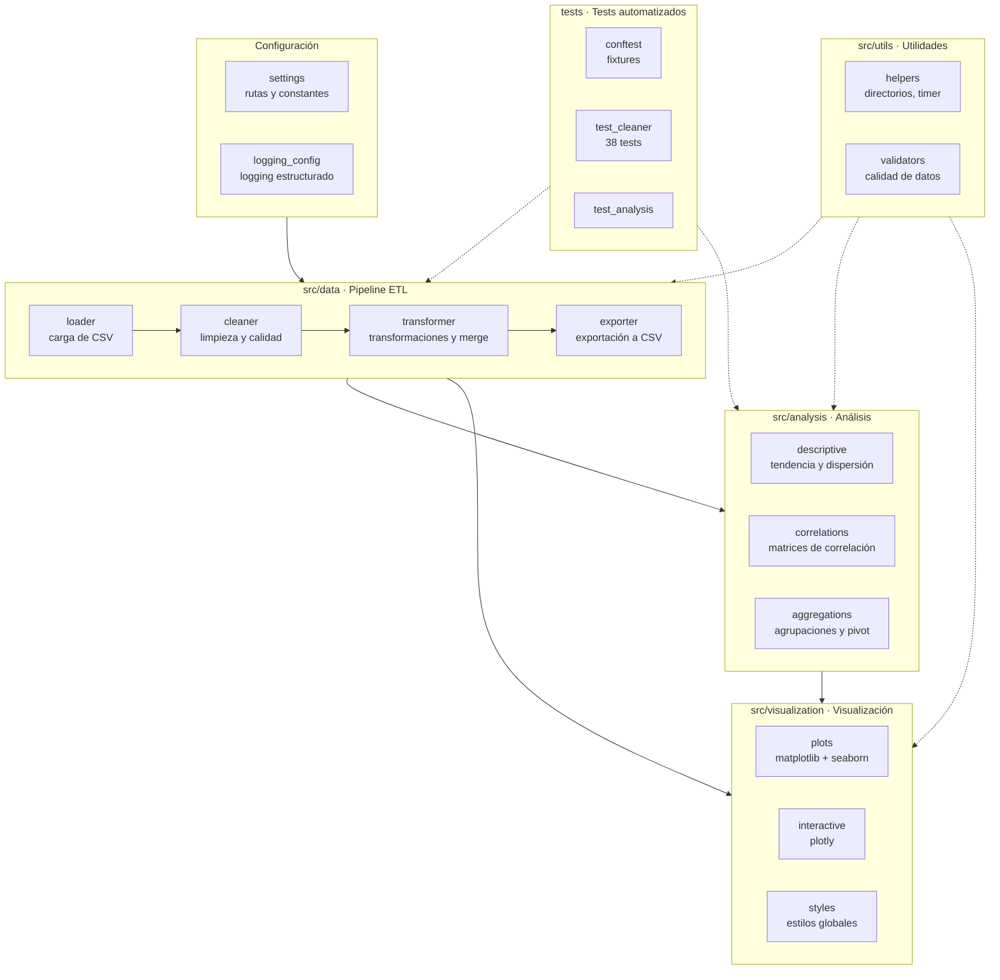
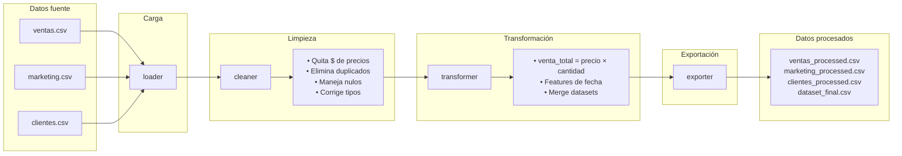
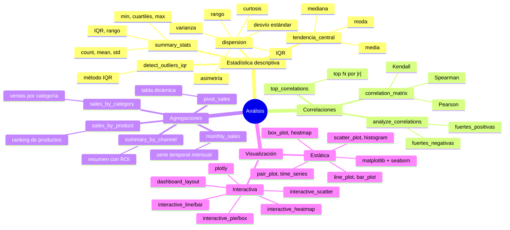
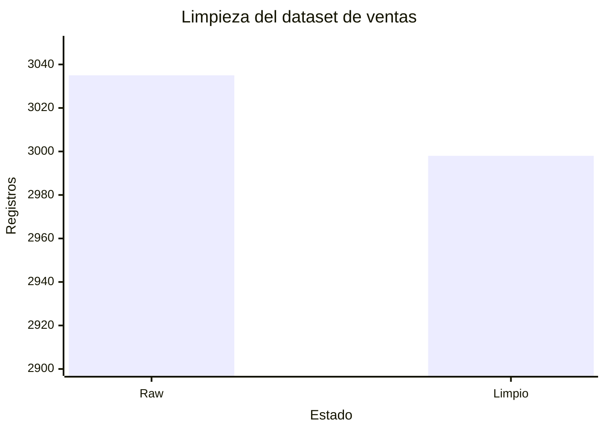
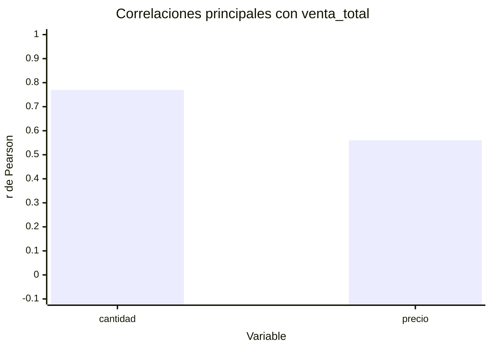
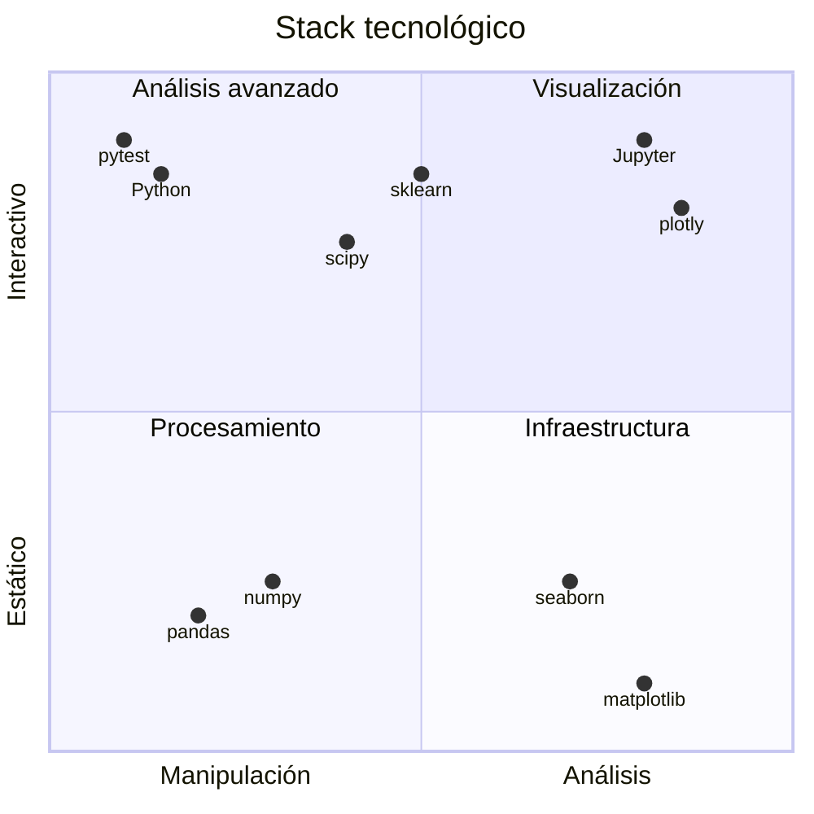

# Data Analytics con Python

Proyecto final integrador de un pipeline completo de análisis de datos: desde la carga y limpieza de datasets reales hasta el análisis exploratorio, visualización y extracción de conclusiones.

---

## Arquitectura del proyecto



## Estructura del proyecto

```
├── config/                        # Configuración central
│   ├── settings.py                #   Rutas y constantes de columnas
│   └── logging_config.py          #   Logging estructurado
├── data/
│   ├── raw/                       # Datos fuente (CSV originales)
│   │   ├── ventas.csv
│   │   ├── marketing.csv
│   │   └── clientes.csv
│   ├── interim/                   # Datos en proceso intermedio
│   ├── processed/                 # Datos limpios y transformados
│   └── external/                  # Datos de referencia externa
└── notebooks/                     # Notebooks Jupyter del análisis
    └── analisis_comercial.ipynb   #   Notebook único con el pipeline completo
├── src/
│   ├── data/                      # Pipeline ETL
│   │   ├── loader.py              #   Carga de CSVs
│   │   ├── cleaner.py             #   Limpieza y calidad
│   │   ├── transformer.py         #   Transformaciones y merges
│   │   └── exporter.py            #   Exportación a CSV
│   ├── analysis/                  # Análisis estadístico
│   │   ├── descriptive.py         #   Medidas de tendencia y dispersión
│   │   ├── correlations.py        #   Matrices de correlación
│   │   └── aggregations.py        #   Agregaciones por categoría, mes, canal
│   ├── visualization/             # Visualización
│   │   ├── plots.py               #   Gráficos estáticos (matplotlib + seaborn)
│   │   ├── interactive.py         #   Gráficos interactivos (plotly)
│   │   └── styles.py              #   Estilos y paletas consistentes
│   └── utils/                     # Utilidades
│       ├── helpers.py             #   Directorios, temporizadores
│       └── validators.py          #   Validación de calidad de datos
├── tests/                         # Tests automatizados
│   ├── conftest.py                #   Fixtures compartidas
│   ├── test_cleaner.py            #   Tests de limpieza
│   └── test_analysis.py           #   Tests de análisis
├── reports/                       # Salidas del proyecto
│   ├── figures/                   #   Gráficos exportados
│   └── dashboard/                 #   Dashboards HTML
├── pyproject.toml                 # Dependencias y metadatos
├── setup.cfg                      # Configuración de herramientas
├── Makefile                       # Comandos comunes
└── README.md
```

---

## Datasets

### ventas.csv
Registro de transacciones comerciales. **3035 filas** originales.

| Columna         | Tipo       | Descripción                     |
|-----------------|------------|---------------------------------|
| id_venta        | int        | Identificador único             |
| producto        | str        | Nombre del producto             |
| precio          | str → float| Precio unitario (con signo $)   |
| cantidad        | int        | Unidades vendidas               |
| fecha_venta     | datetime   | Fecha de la transacción         |
| categoria       | str        | Categoría del producto          |

### marketing.csv
Inversión en campañas publicitarias.

| Columna        | Tipo       | Descripción                     |
|----------------|------------|---------------------------------|
| id_campanha    | int        | Identificador de campaña        |
| producto       | str        | Producto promocionado           |
| canal          | str        | Canal de marketing              |
| costo          | str → float| Inversión (con ceros adelante)  |
| fecha_inicio   | datetime   | Inicio de campaña               |
| fecha_fin      | datetime   | Fin de campaña                   |

### clientes.csv
Perfil de clientes.

| Columna      | Tipo    | Descripción                     |
|--------------|---------|---------------------------------|
| id_cliente   | int     | Identificador único             |
| edad         | int     | Edad del cliente                |
| ingresos     | float   | Ingreso anual estimado          |
| ciudad       | str     | Ciudad de residencia            |

---

## Pipeline de datos

El pipeline sigue 4 etapas componibles. Cada etapa se puede ejecutar de forma independiente.



### Ejecución individual

```python
from src.data.loader import load_all_datasets
from src.data.cleaner import clean_all
from src.data.transformer import build_full_pipeline
from src.data.exporter import export_all

datos = load_all_datasets()
limpios = clean_all(datos)
final = build_full_pipeline(*limpios)
export_all(ventas=limpios[0], marketing=limpios[1], clientes=limpios[2], final=final)
```

### make data

```bash
make data
```

Ejecuta el pipeline completo de punta a punta: carga → limpia → transforma → exporta.

---

## Análisis disponible



### Detalle de funciones

**Módulo `src/analysis/descriptive.py`**

| Función               | Descripción                                                |
|-----------------------|------------------------------------------------------------|
| `tendencia_central`   | Media, mediana y moda para columnas numéricas              |
| `dispersion`          | Varianza, std, rango, IQR, asimetría y curtosis            |
| `summary_stats`       | DataFrame resumen con count, mean, std, min, cuartiles, max, IQR, rango |
| `detect_outliers_iqr` | Detecta outliers usando el método del rango intercuartil   |

**Módulo `src/analysis/correlations.py`**

| Función                | Descripción                                               |
|------------------------|-----------------------------------------------------------|
| `correlation_matrix`   | Matriz de correlación (Pearson, Spearman, Kendall)        |
| `analyze_correlations` | Clasifica pares en fuertes positivas/negativas por threshold |
| `top_correlations`     | Devuelve los N pares con mayor |r|                         |

**Módulo `src/analysis/aggregations.py`**

| Función                 | Descripción                                     |
|-------------------------|-------------------------------------------------|
| `sales_by_category`     | Ventas agregadas por categoría                  |
| `sales_by_product`      | Ranking de productos por venta total            |
| `monthly_sales`         | Serie temporal de ventas por mes                |
| `pivot_sales`           | Tabla dinámica productos × métricas             |
| `summary_by_channel`    | Resumen por canal con ROI                       |

**Módulo `src/visualization/`**

```
Estáticas (matplotlib + seaborn)
  line_plot, bar_plot, scatter_plot
  histogram, box_plot, correlation_heatmap
  pair_plot, time_series_plot

Interactivas (plotly)
  interactive_line, interactive_bar, interactive_scatter
  interactive_pie, interactive_box, interactive_heatmap
  dashboard_layout
```

---

## Notebooks


El notebook `analisis_comercial.ipynb` recorre todo el pipeline de principio a fin: carga, limpieza, transformación, análisis exploratorio, correlaciones, detección de anomalías, visualizaciones estáticas e interactivas, y conclusiones. Cada celda importa los módulos de `src/`.

---

## Resultados clave





| Hallazgo                                          | Detalle                                                                  |
|---------------------------------------------------|--------------------------------------------------------------------------|
| Limpieza de ventas                                | 3035 → 2998 registros (37 eliminados: 35 duplicados + 2 nulos)          |
| Correlación más fuerte                            | `cantidad` vs `venta_total` (**r = 0.77**) — a más unidades, mayor total |
| Correlación precio-cantidad                       | Prácticamente nula (**r = -0.002**) — el precio no afecta las unidades   |
| Correlación precio-venta_total                    | Moderada (**r = 0.56**) — productos más caros contribuyen más al total   |
| Outliers en ingresos de clientes                  | Detectables mediante el método IQR                                       |
| Costos de marketing                               | Ceros adelantados (`"05.07"`) normalizados con `pd.to_numeric`           |

---

## Tests

```
make test
```

O directamente:

```
python -m pytest tests/ -v
```

Actualmente **38 tests** cubriendo limpieza de datos y análisis estadístico. Las fixtures en `conftest.py` proporcionan DataFrames de ejemplo reutilizables.

---

## Instalación

### Requisitos

- Python ≥ 3.10
- pip (incluido con Python)

### Paso a paso

```bash
# 1. Clonar el repositorio
git clone <repo-url>
cd Data-Analytics-con-Python

# 2. Crear el entorno virtual (un archivo .venv/ en el proyecto)
python -m venv .venv

# 3. Activar el entorno virtual
#    Windows (cmd o PowerShell):
.venv\Scripts\activate
#    Windows (Git Bash):
source .venv/Scripts/activate
#    Linux / macOS:
source .venv/bin/activate

# 4. Instalar el proyecto en modo desarrollo (incluye todas las dependencias)
pip install -e .

# 5. Verificar que funciona
python -c "import pandas, numpy, matplotlib, seaborn, plotly; print('Todo listo')"
```

> **¿Por qué usar un entorno virtual?** Aísla las dependencias del proyecto para evitar conflictos con otros proyectos de Python en tu máquina. Siempre activá el entorno antes de trabajar (`source .venv/bin/activate` o `.venv\Scripts\activate`).

### Para Jupyter

Si querés usar el notebook desde el entorno virtual:

```bash
pip install jupyter
python -m ipykernel install --user --name=data-analytics --display-name="Data Analytics"
jupyter notebook notebooks/analisis_comercial.ipynb
```

Esto registra el entorno como kernel de Jupyter y lo podés seleccionar desde la interfaz del notebook.

### Dependencias principales

pandas, numpy, matplotlib, seaborn, plotly, scipy, scikit-learn, nbformat, jupyter

---

## Tecnologías y herramientas



| Herramienta       | Propósito                                       |
|-------------------|-------------------------------------------------|
| Python 3.14       | Lenguaje base                                   |
| pandas            | Manipulación y análisis de datos                |
| numpy             | Operaciones numéricas                           |
| matplotlib        | Gráficos estáticos                              |
| seaborn           | Gráficos estadísticos                           |
| plotly            | Visualizaciones interactivas                    |
| scipy             | Pruebas estadísticas adicionales                |
| scikit-learn      | Preparación para modelos de ML                  |
| pytest            | Tests automatizados                             |
| nbformat          | Generación programática de notebooks            |
| Jupyter           | Entorno de análisis exploratorio                |
