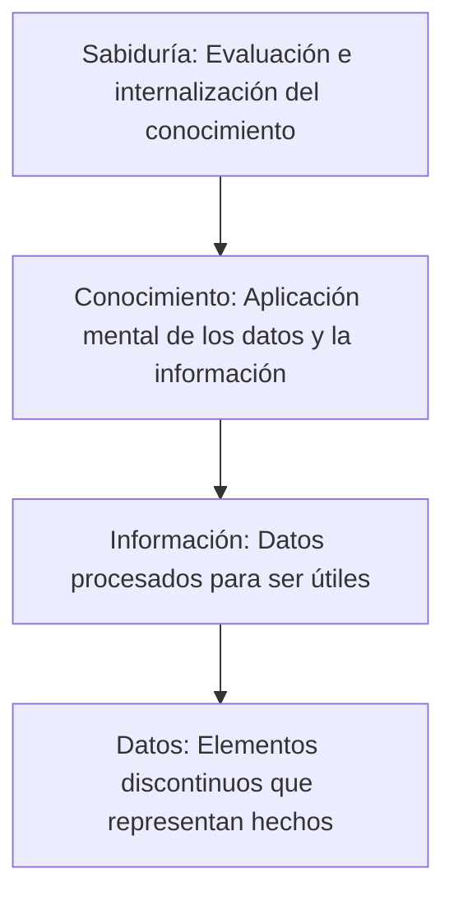
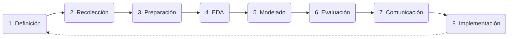

# Introducción al Análisis de Datos y Fundamentos Tecnológicos

## 1. Conceptos Básicos en Ciencias de Datos y Data Analytics

La ciencia de datos es una disciplina interdisciplinaria que combina las matemáticas, la estadística, la informática y el conocimiento de dominio para extraer conocimiento e insights valiosos a partir de los datos.

### ¿Qué es Data Analytics?
Data Analytics (Análisis de Datos) es el proceso sistemático de examinar conjuntos de datos con el objetivo de extraer conclusiones valiosas, identificar tendencias y patrones, y facilitar la toma de decisiones informadas dentro de una organización.

### Definiciones Tecnológicas Clave
* **Big Data:** Conjuntos de datos tan grandes y complejos que las herramientas tradicionales no son suficientes. Se caracteriza por las "3 Vs": volumen, velocidad y variedad.
* **Análisis de Datos:** Proceso de inspeccionar, limpiar y modelar datos. Incluye análisis descriptivo, predictivo y prescriptivo.
* **Modelado Predictivo:** Uso de modelos estadísticos y algoritmos de machine learning para predecir resultados futuros basados en datos históricos.
* **Machine Learning (Aprendizaje Automático):** Parte de la inteligencia artificial que permite a las máquinas aprender de los datos y mejorar su rendimiento en tareas específicas sin ser programadas explícitamente (clasificación, regresión y agrupamiento).
* **Inteligencia Artificial (IA):** Simulación de procesos de inteligencia humana por parte de sistemas computacionales.
* **Visualización de Datos:** Técnica que convierte datos en representaciones gráficas o visuales para facilitar su comprensión.
* **Minería de Datos:** Proceso de descubrir patrones significativos y relaciones en grandes conjuntos de datos.

---

## 2. Pirámide de Jerarquía del Conocimiento

La transformación de los elementos primitivos en valor estratégico se organiza a través de niveles jerárquicos donde cada nivel superior se basa en el anterior:



1. **Sabiduría:** Capacidad para hacer juicios y tomar decisiones basadas en el conocimiento. Implica experiencia y reflexión (Ejemplo: "Los días de 29 grados en Rosario, es recomendable llevar agua y protector solar").
2. **Conocimiento:** Comprensión e interpretación de la información para aplicarla en contextos específicos (Ejemplo: "Sabemos que 25°C es una temperatura alta para Rosario en invierno").
3. **Información:** Datos organizados o procesados para darles significado (Ejemplo: "La temperatura en Rosario es de 29°C").
4. **Datos:** Hechos y cifras sin contexto. Por sí solos, no tienen significado (Ejemplo: "29°C", "Rosario").

---

## 3. Procesos en Ciencias de Datos

El análisis de datos es un proceso sistemático y cíclico que se compone de las siguientes etapas clave:



1. **Definición del problema:** Identificar claramente la pregunta o el desafío.
2. **Recolección de datos:** Obtener datos relevantes (fuentes primarias o secundarias).
3. **Preparación de datos:** Limpieza, eliminación de duplicados, manejo de valores faltantes y formato.
4. **Análisis Exploratorio de Datos (EDA):** Examinar datos limpios mediante estadísticas y visualizaciones.
5. **Modelado:** Aplicar técnicas estadísticas o de machine learning.
6. **Evaluación:** Verificar efectividad y precisión del modelo.
7. **Interpretación y comunicación de resultados:** Traducir hallazgos en insights comprensibles.
8. **Implementación y seguimiento:** Integrar en decisiones y monitorear el impacto.

---

## 4. Tecnologías de la Información y Comunicación (TIC)

* **Sistemas de Gestión de Bases de Datos (DBMS):** MySQL, PostgreSQL.
* **Herramientas de Visualización:** Tableau, Looker Studio, Power BI.
* **Lenguajes de Programación:** Python, R.
* **Plataformas de Big Data:** Apache Hadoop, Apache Spark.
* **Servicios en la Nube:** AWS, Google Cloud Platform (GCP), Microsoft Azure.
* **Herramientas de Machine Learning e IA:** TensorFlow, Scikit-learn.
* **Sistemas de Business Intelligence (BI):** IBM Cognos, SAP Business Objects.

---

## 5. Ramas de las Ciencias de Datos y Roles

### Ramas
* **Estadística:** Recolección, análisis e interpretación.
* **Matemáticas:** Álgebra lineal (matrices y vectores) y Cálculo (optimización de funciones).
* **Informática y Programación:** Marco tecnológico (Python, R).
* **Machine Learning & Big Data:** Algoritmos de aprendizaje y procesamiento a gran escala.
* **Visualización & Minería de Datos:** Representación gráfica y descubrimiento de patrones.
* **Ciencias Sociales y Humanas:** Comprensión de comportamientos y tendencias.
* **Ética y Privacidad de los Datos:** Uso responsable y equitativo de la información.

### Roles Profesionales
* **Científico de Datos:** Analiza y modela datos para extraer información.
* **Ingeniero de Datos:** Se enfoca en la arquitectura y flujo de datos.
* **Analista de Datos:** Realiza análisis descriptivos y proporciona informes.
* **Especialista en Machine Learning:** Desarrolla modelos predictivos.

---

## 6. Entornos de Trabajo Interactivos

### Jupyter Notebooks
Aplicaciones web interactivas que permiten crear y compartir documentos con código, ecuaciones, visualizaciones y texto narrativo (Markdown). Permiten la ejecución de código en vivo (Python, R, Julia) de forma independiente por bloques.

### Plataformas de Ejecución
1. **Anaconda:** Distribución de Python con interfaz gráfica (Anaconda Navigator).
2. **Google Colaboratory (Colab):** Plataforma en línea de Google con acceso gratuito a GPUs, cero configuración y facilidad para compartir.
3. **JupyterHub:** Plataforma para servidores compartidos (ideal para educación).
4. **Microsoft Azure Notebooks:** Servicio en la nube de Microsoft.
5. **Kaggle Kernels:** Entornos basados en Jupyter dentro de la plataforma de competiciones Kaggle.

---

## 7. Estructuras de Datos en Python y Librerías Analíticas

### Estructuras de Datos Básicas (Python Nativo)
* **Listas (`[]`):** Colecciones ordenadas y mutables. Ej: `[1, 2, 'hola']`.
* **Tuplas (`()`):** Colecciones ordenadas e inmutables. Ej: `(1, 2, 'hola')`.
* **Diccionarios (`{}`):** Pares clave-valor, desordenados y mutables. Ej: `{'nombre': 'Juan'}`.
* **Conjuntos / Sets (`{}`):** Colecciones no ordenadas de elementos únicos y mutables. Los inmutables son *frozensets*.
* **Cadenas de texto (Strings):** Secuencias inmutables de caracteres.

### Librerías para Análisis de Datos
* **Pandas:** Estructuras flexibles para manipulación tabular.
* **NumPy:** Cálculo numérico eficiente.
* **Matplotlib:** Biblioteca de visualización 2D (gráficos estáticos, animados, interactivos).
* **Seaborn:** Visualización estadística avanzada basada en Matplotlib.
* **SciPy:** Cálculos científicos y técnicos (optimización, álgebra lineal).
* **Scikit-learn:** Aprendizaje automático (clasificación, regresión, agrupamiento).
* **Statsmodels:** Análisis estadístico profundo y pruebas de hipótesis.

---

## 8. Estructuras de Datos Avanzadas: NumPy y Pandas

### NumPy: El objeto `ndarray`
Permite almacenar datos en arreglos multidimensionales del mismo tipo, optimizando el rendimiento.

* **1D Array:** `[3] [2]`
* **2D Array (Matriz):**
  ```text
  [1] [0] [1]
  [3] [4] [1]
  ```
* **3D Array (Cubo):** Estructuras con profundidad, filas y columnas simultáneas.

### Pandas: `Series` y `DataFrame`
* **Series:** Colección unidimensional con etiquetas en los índices.
* **DataFrame:** Colección bidimensional (tabla). Ejemplo de un DataFrame típico (Datos de vuelos):

| year | month | day | dep_time | dep_delay | arr_time | arr_delay | carrier | tailnum | flight | origin | dest | air_time | distance | hour | minute |
| :--- | :--- | :--- | :--- | :--- | :--- | :--- | :--- | :--- | :--- | :--- | :--- | :--- | :--- | :--- | :--- |
| 2014 | 1 | 1 | 1.0 | 96.0 | 235.0 | 70.0 | AS | N50BAS | 145 | PDX | ANC | 194.0 | 1542 | 0.0 | 1.0 |
| 2014 | 1 | 1 | 4.0 | -6.0 | -23.0 | 738.0 | US | N195UW | 1830 | SEA | CLT | 252.0 | 2279 | 0.0 | 4.0 |
| 2014 | 1 | 1 | 8.0 | 13.0 | 548.0 | -4.0 | UA | N37422 | 1509 | PDX | JAH | 201.0 | 1825 | 0.0 | 8.0 |